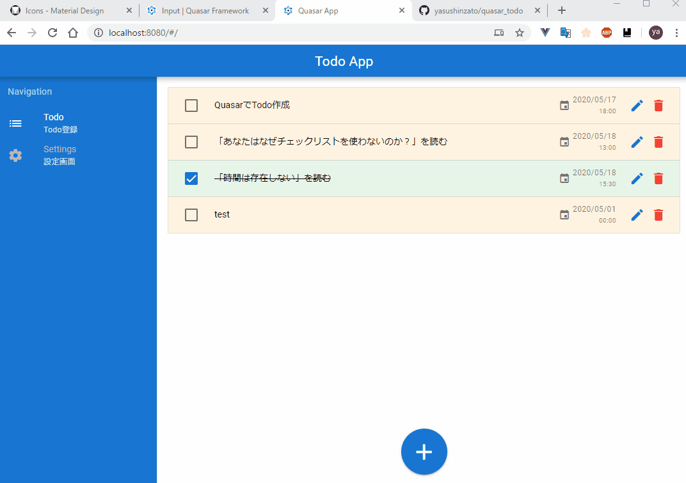
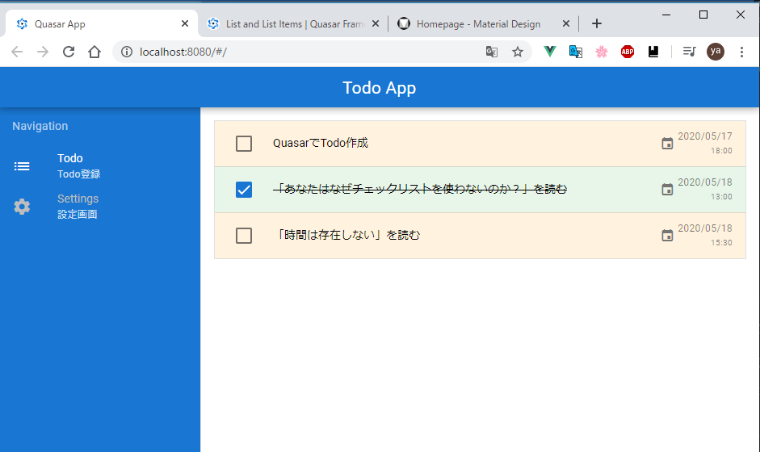
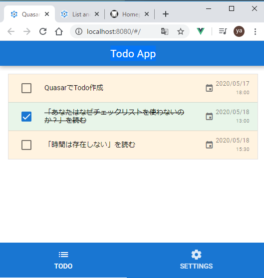

# QuasarでTodo

Vue.jsベースのフレームワーク。
Quasarでいろいろなプラットフォーム(Windows,Mac,android,iphone)と
PCとモバイルでの開発が容易にできるフレームワーク

`npm install -g @quasar/cli`
`quasar create hogeProject`
`quasar dev`
起動は2分くらいと遅いが、ソースコードを保存すると即反映されるようになる。

- 利用イメージ

- PCサイズでの画面表示  

- モバイルサイズでの画面表示  

## firebase
bootファイルを使用してプロジェクトにFirebaseを追加する。

https://quasar.dev/quasar-cli/boot-files#Usage-of-boot-files

対象フォルダで以下コマンドを実行(名前はfirebaseにする。)
`quasar new boot firebase`
quasar.conf.jsファイルに`boot:['firebase']`を記述する

boot\firebase.js
が作られるので、→の記述を行う。`boot:['firebase']`

Node.jsアプリを構成する。
ステップ 3: Firebase SDK を追加して Firebase を初期化する
https://firebase.google.com/docs/web/setup?authuser=0#node.js-%E3%82%A2%E3%83%97%E3%83%AA
`npm install --save firebase`

